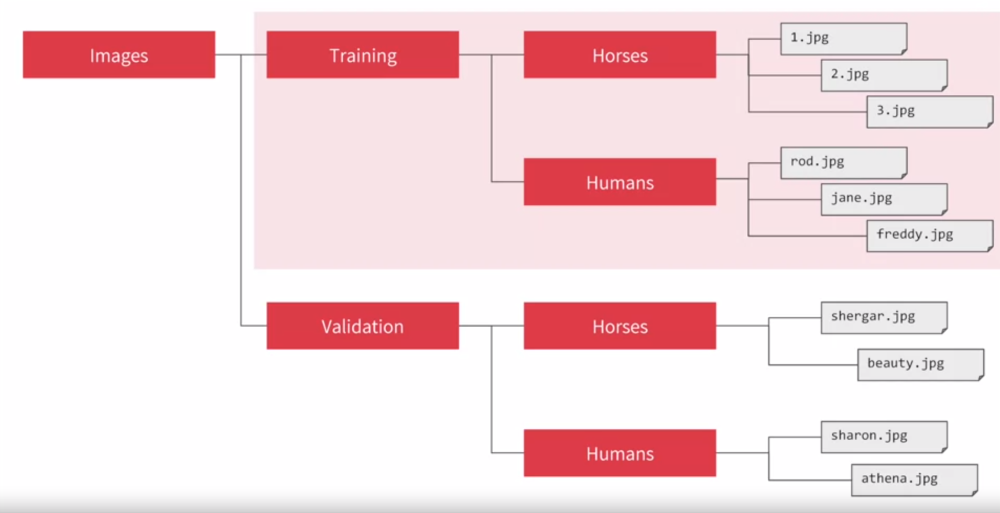

##### Learning Objectives

- Reflect on the possible shortcomings of your binary classification model implementation
- Execute image preprocessing with the Keras ImageDataGenerator functionality
- Carry out real life image classification by leveraging a multilayer neural network for binary classification

